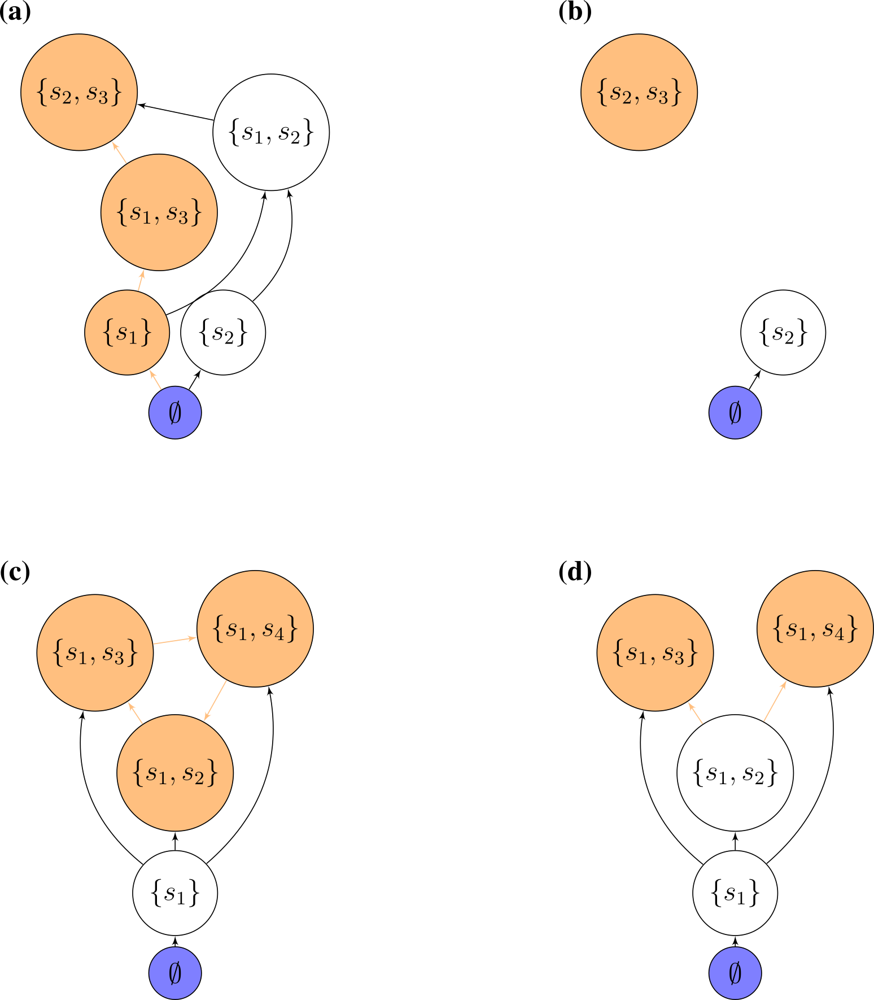

# Bottom-up assembly

> Mother Nature, of course, does not assemble her networks by throwing *n* species together in one go. It makes more sense to assume that she adds one species after another through successive invasions. 
>
> @sigmuiud1995darwin

Having considered the case in which all species are thrown into the habitat at the same time (**top-down** assembly), we consider a process in which we start from the "bare ground" and build our community from the **bottom-up**.

Note that in top-down assembly, any feasible equilibrium can be achieved by starting with the appropriate initial conditions; being slightly less generous, we can think of being able to assemble from the top-down any "persistent" (e.g., stable), feasible community we can form from the pool. It makes therefore sense to ask whether these same states can or cannot be accessed when assembling the community from the ground up.

## An assembly graph

In GLV, a given (sub-)community has at most one feasible equilibrium; that is, there is **no true multi-stability in GLV**: we can find the system at different stable states, but **they have to differ in composition**. Because of this fact, we can devise a scheme to label the possible states our community can be in. 

We call $0$ the state in which no species are present, $1$ the state in which only species 1 is present, $2$ the state in which only species 2 is present, $3$ the state in which species 1 and 2 are both present, and so on. Practically, we take the community composition to be the base-2 representation of the label. For example, label $11$ in a community of 6 species corresponds to $001011$ (i.e., a state in which species 1, 2, and 4 are present). As this notation makes obvious, for a given pool of $n$ species, we can have up to $2^n - 1$ feasible equilibria. As we saw in Lecture 1, the existence of a feasible equilibrium is a necessary (but not sufficient---we should require also some form of stability/permanence) condition for coexistence.

Clearly, any feasible (and persistent/stable) sub-community can be observed by initializing the system at (or, in case of locally/globally stable configurations, close to) the desired densities. On the other hand, unstable configurations will eventually collapse to some other sub-community. As such, we take the labels/states representing stable/persistent communities to be the **nodes** in a directed graph. Then, we take the **edges** of this graph to represent invasions, moving the local community from one state to another. To keep the graph simple, we only consider "successful" invasions (i.e., those for which the initial and final state differ), thereby removing the need for "self-loops".

This **assembly graph** was considered several times in the literature (see for example @law1993alternative, @hang1993assembly, @schreiber2004simple, @capitan2009statistical). Here, we follow the approach @servan2020tractable, and note that the assembly graph fully describes the assembly process whenever the assumptions that we've made at the onset of our exploration (invasions are rare, invasions are small, dynamics converge to equilibria) are satisfied. When this is the case, we can study the assembly process in its full glory by studying a graph (which definitely sounds more fun!).

### How many invasions?

First, we might want to think of the problem of invasion. The bottom-up assembly can be seen as a single, massive invasion. At the other extreme, we have assembly proceeding with invasions of a single species at a time. Of course, we can imagine anything in between: species invade in small groups, there is a distribution describing the number of species invading at each step, etc.

For example, let's build the assembly graph for a given set of (random) parameters: we take $A$ to be a symmetric, **stable** nonpositive matrix (e.g., representing competition between species), and $r$ to be a vector of positive, random growth rates. Let's build the assembly graph when we consider that species can enter the system only one at a time:

```{r}
source("code/general_code.R")
source("code/L-H.R") # Lemke-Howson algorithm to get saturated equilibrium
source("code/build_assembly_graph.R") # code to build and draw assembly graphs for symmetric matrices
set.seed(4) # for reproducibility
A <- build_competitive_stable(4)
r <- runif(4)
assembly_invasion_1 <- build_assembly_graph(r, A)
plot_assembly_graph(assembly_invasion_1$graph, assembly_invasion_1$info)
```

What if we allow for two invasions at a time?

```{r}
assembly_invasion_2 <- build_assembly_graph(r, A, 2)
plot_assembly_graph(assembly_invasion_2$graph, assembly_invasion_2$info)
```

And allowing four invasions in one go (as in top-down assembly):

```{r}
assembly_invasion_4 <- build_assembly_graph(r, A, 4)
plot_assembly_graph(assembly_invasion_4$graph, assembly_invasion_4$info)
```

For simplicity, let's stick with the case in which only a single species enter in the local community at every invasion event.

## Properties of the assembly graph

**Accessibility**: which states can we reach starting from the bare ground, and performing invasions of (say) one species at a time? We call states that can be built in this way "accessible". Translated into graph properties, we call a state accessible if there is a path leading from the state 0 to the community of interest ("an assembly path"). If all states are accessible, we call the graph itself accessible. States that are not accessible can be reached by top-down, but not bottom-up assembly.

**Cycles**: directed cycles in the graph translate into sub-communities for which invasions drive the system in a cyclic composition (a generalization of rock-paper-scissors!).

**Assembly endpoints**: if a node has no outgoing edges, assembly will stop once the corresponding state has been reached. We call this state an "assembly endpoint". A more complex type of assembly endpoint is that in which there is a cycle connecting two or more communities, and the cycle as a whole has no outgoing edges. 



## Assembly graphs for GLV

For GLV with symmetric, competitive interactions (actually, for a slightly more general case), @servan2020tractable proved that:

- For a species pool of competitors (i.e., a given $r > 0$ and a symmetric matrix $A < 0$), **the bottom-up assembly endpoints are the same as the endpoints for top-down assembly**. This means that all states are accessible, and therefore we can build any feasible, stable sub-community from the ground up. In fact, for each sub-community we can find the "shortest" assembly path, which we can construct without any extinctions.

- **The assembly graph is acyclic**, meaning that we will never observe communities with cyclic compositions.

- **Every walk on the assembly graph eventually reaches a sink**, and, when $A$ is stable, **the sink is unique**. This means that for this type of species pool, historical contingencies (@fukami2015historical) are impossible---if we wait for long enough, the system will always reach the same state, thereby erasing any trace of the assembly history.

## Relationship with Lyapunov functions

If a graph has the properties above (acyclic, single source, single sink), then there is a way to order the node such that all edges point in the same direction (topological sorting). In this case, we can devise an "energy" associated with each community state such that assembly "maximizes" the quantity, connecting "low-energy" states to "high-energy ones" via invasion.

In fact, we can even devise such a function, it is exactly the Lyapunov function devised by @macarthur1970species [Note: the first paper ever in Theoretical Population Biology!]:

$$
V(x) = 2 \sum_i r_i x_i + \sum_{i,j} A_{ij} x_i x_j
$$

MacArthur proved that this quantity is maximized through the dynamics. At equilibrium, we find $V(x^\star) = \sum_i r_i x_i^\star$. During assembly, community composition changes such that $V(\bar{x})$  is maximized through the assembly process. Note that when $r_i = 1$ for all species, then $V(\bar{x})$ is simply the total biomass in the community. As such, through invasions the total biomass in the community is maximized. 

This result would have pleased Cowles, Gleason, Odum, and many of the pioneers of succession! For these (restrictive) conditions, assembly is indeed an orderly, predictable process, culminating in a "climax" with a clear ecological interpretation (for a similar result in a completely different context, see @suweis2013emergence).

## How many assembly endpoints?

What happens when the matrix $A$ is still nonpositive and symmetric, but not stable? In this case, it is Gleason who can laugh---for unstable matrices we can have several assembly endpoints, thereby reinstating the role of chance in determining the ultimate fate of the community.

Interestingly, how the number of assembly endpoints changes when we change the parameters of the model is an open problem---in fact we haven't even characterized the worse-case scenario. See @biroli2018marginally for a derivation showing that they should be growing exponentially with size.

## Build your own assembly graph!

Building the assembly graph is computationally very expensive, even with all these results at hand. Fortunately, we do not need to integrate the dynamics (a point that was greatly debated in the literature, see @morton1996models for one of the rare cases in which a debate ends up with consensus between opposing factions).

Currently, the algorithm can be sketched as:

- for each of the $2^n$ possible sub-communities (ranging from bare ground to all species present), determine whether the sub-community is feasible and stable;
- now go through all the feasible, stable communities; for each determine the "neighbor" communities that can be reached with (say, one) invasion(s). 
- call $S$ the feasible, stable community, and add species $j$ (or multiple species), and check that $j$ can invade when rare. If it cannot, move to the next neighbor; If it can, there are two cases:
  - if the community $\{S, j\} = S'$ is feasible and stable, draw an edge $S \to S'$
  - if the community $\{S, j\} = S'$ is not feasible and stable, the system will collapse to a smaller sub-community; to determine which sub-community it will collapse to, **check all the possible sub-communities** of $S'$, and take the one with the greatest $V(x^\star)$, $S''$. Draw an an edge $S \to S''$

Can a better (faster, more efficient) algorithm be devised?

## Conclusions

We have explored the problem of ecological assembly by working with the Generalized Lotka-Volterra model and three main assumptions: 1) invasions are rare, such that invaders always find the local community at the attractor; 2) invasion sizes are small; and 3) dynamics always lead to equilibria--thereby allowing us to  determine the effect of any invasion uniquely. 

These three assumptions made the study of assembly **tractable, and yet not trivial**, allowing us to map the complex dynamics of the system into an **assembly graph**, and the properties of this graph translate directly into ecological properties of the assembly process. 

For competitive Lotka-Volterra with symmetric interactions, when the interaction matrix is stable, all assembly paths will eventually lead to the same state (the "saturated equilibrium" we've seen in Lectures 1 and 2). In this case, the history that led to the community cannot be reconstructed from the final state. When the matrix of interactions is unstable, on the other hand, the system can end up in different places depending on the history of assembly.

We have also found that for these cases, **top-down** (all in one go) and **bottom-up** (sequential) assembly can reach exactly the same states.  Top-down assembly experiments (e.g., with bacterial communities) are much easier to perform than bottom-up ones, and I believe that this approach has been underexploited (both theoretically, and experimentally).

Much more work remains to be done to reach a general theory of ecological assembly (even for GLV), but the results shown here provide a good springboard, and an expectation, for the study of more complex cases.

# References and readings
